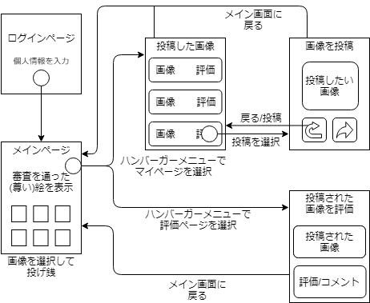

# ハッカソン

## 依存関係
- フロントエンド
  - HTML
  - CSS
  - Bootstrap
  - Javascript
    - JqueryJquery
- バックエンド
  - XAMPP
  - firebase

## 画面構成

- ログインページ 
アカウント名を入力するとサイトにアクセスすることが出来ます。
- メインページ 
過去に多くの絵師が投稿したイラストがリストアップすることがされます。 
画像のクリックをすることで拡大したのち投げ銭を行うことができます。 
また、ここからイラストのマイページ及び評価ページへの遷移が行えます。 
- マイページ 
ここでは自分が過去に投稿した画像を確認することができます。 
画像には画像の画像に対する状態が「合格」「申請待ち」「不合格」の3つから与えられます。 
この評価が「合格」の場合のみメイン画面に表示される画像としてPOST可能です。 
このページの遷移先にPOSTのページがあります。
- 投稿ページ 
ここでは画像を審査対象として投稿することが出来ます。 
ここから投稿された画像はマイページの投稿済み画像として登録され、「審査待ち」のstateが与えられます。 
そして、この投稿後、画像は評価ページにて審査されます。
- 評価ページ 
ここで審査待ちのイラストを評価することが出来ます。 
ここで言って以上の評価を受けるとそのい内容が作成者のマイページに反映されます。 
